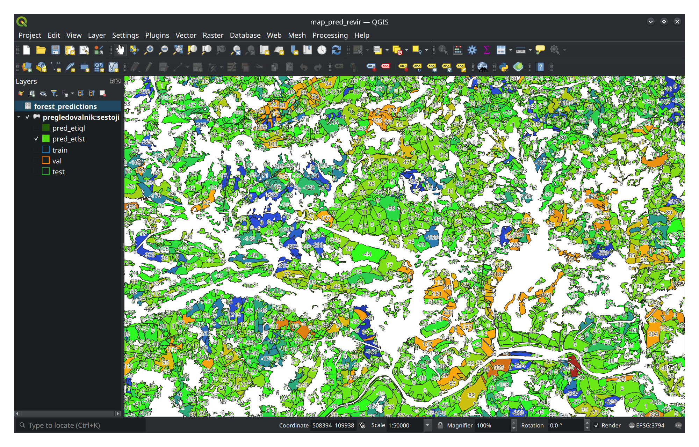

# Sustainable Forestry Planning with Graph Neural Networks

This project focuses on developing a GNN model to predict key attributes about the forest, based on the spatial information and metadata of the forest units in Slovenia.

The goal was to support a more efficient, consistent, and scalable preparation of forest management plans. By automating the estimation of selected attributes of forest units, the proposed approach can help identify anomalies, reduce manual effort, and improve the overall reliability of planning processes for future forest management initiatives.

## Blog post: 

More information about this project is available in [this article](https://medium.com/@stefanstrucelj22/98987498d918).

## Dataset:

The data were provided by Slovenia Forest Service and can be viewed on this site: [Pregledovalnik podatkov o gozdovih](https://prostor.zgs.gov.si/pregledovalnik/) 

Our parsed and pre-processed dataset, ready for GNN training: 
[forest_db.sqlite](https://drive.google.com/file/d/1f3VSCSu_NWmmrRq_ExB0XNmTrIZOsHQU/view?usp=drive_link) (2.45gb)

## Heatmap:

You can view predictions of our GraphSAGE model (inductive data split) on a heatmap shown below.

To view the fully rendered map for the whole country:
1) Download and install the open-source geographical information system [QGIS] (https://qgis.org/)
2) Once installed follow the instructions on the ZGS website to connect their WFS layer to QGIS
3) When you have the ZGS layers connected open the .qgz file located in our project under /models/graphSAGE/best_revir_split
4) QGIS will prompt you with how to handle unavailable layers, select to keep them
5) Select the red exclamation mark next to the table forest_predictions in the layers panel and set the file path to the forest_predictions.csv in the same directory as the .qgz file
6) You can now pan around the map to view predictions
