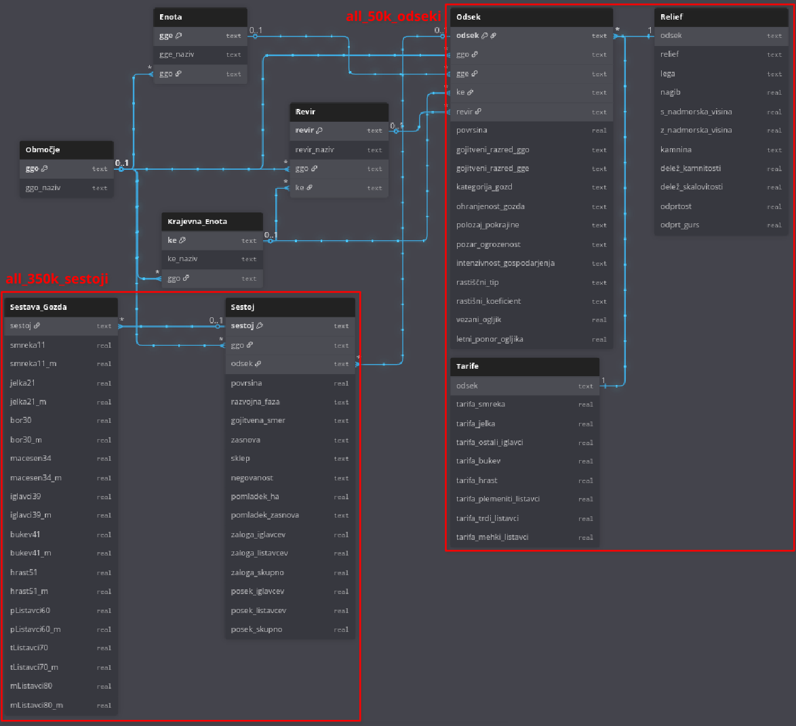
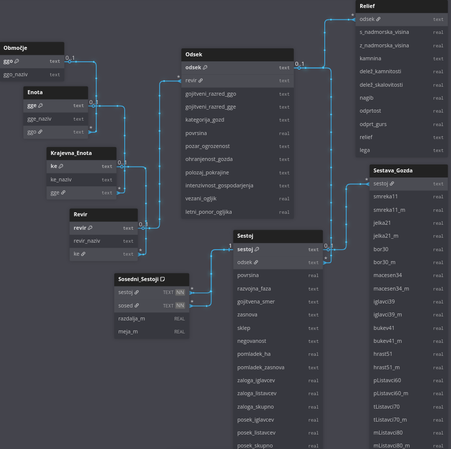

# ZGS PROJEKT ZA OCENITEV POSEKA IN DRUGIH ATRIBUTOV GOZDA

Naš glavni cilj bo zgraditi RDL model, ki bo na podlagi meta podatkov odsekov za sestoje ter strukture k-sosednih sestojev lahko sam napovedal določene atribute sestojev. Model bo tako lahko prispeval k učinkovitejši in bolj konsistentni pripravi prihodnjih gozdno gospodarskih načrtov.

## PODATKI IZ PREGLEDOVALNIKA

Website: [Pregledovalnik podatkov o gozdovih](https://prostor.zgs.gov.si/pregledovalnik/)

Full raw dataset encompassing the entire country:

- [50k_all_odseki.sqlite](https://drive.google.com/file/d/1-k_Y9iBYT9Aj8qa6Ns19J-wyWem4eqIh/view?usp=drive_link)
- [350k_all_sestoji.sqlite](https://drive.google.com/file/d/1B5DAeCr2gHqvvHo4pdXN9eu8m2iEm7Vg/view?usp=drive_link)

Hierarhija enot:
GGO > Krajevne enote > GGE > Revirji > Odseki > Sestoji

Trenutno stanje podatkov v bazi:

### Odsek:

| Attribute | Description |
|-----------|-------------|
| ggo | gozdno gospodarkso območje |
| ke | krajevna enota |
| gge | gozdno gospodarksa enota |
| revir | … |
| odsek | … |
| povrsina[ha] | … |
| gojitveni razred ggo | … |
| gojitveni razred gge | … |
| kategorija gozda | … |
| ohranjenost gozda | … |
| polozaj pokrajine | … |
| pozarna ogrozenost | … |
| intenzivnost gospodarjenja | … |
| (vezani ogljik, letni ponor ogljika) | mogoče relevantno mogoče ne? |
| nadm. višina[m] (min,max) | … |
| kamnina | apnenec, dolomit, fliš, diluvialna ilovica, morena karbonatna... |
| delež kamnitosti[%] | delež kamnine, ki je označen zgoraj (preveri) |
| delež skalovitosti[%] | delež skalovja, ki pokriva tla |
| nagib[˚] | … |
| odprtost[%] | odprtost zaradi vlak (vlaka = gozdna "cesta") |
| odprtost za gurs | to baje vključuje odprtost zarad vlak in cest nasplošno (preveri) |
| relief | … |
| lega | nagib glede na kardinalno smer (S, J, V, Z, SZ, JV...) |

### Sestoj:

| Attribute | Description |
|-----------|-------------|
| odsek | … |
| sestoj | … |
| povrsina[ha] | … |
| razvojna faza | … |
| gojitvena smer | … |
| zasnova | … |
| sklep | … |
| negovanost | … |
| površina pomladka[ha] | … |
| pomladek zasnova | … |
| sestava gozda | jelke[%], bukve[%], mehki listavci[%]… |
| zaloga iglavcev [m^3] | … |
| zaloga listavcev[m^3] | … |
| posek iglavcev | naš prediction! |
| posek listavcev | naš prediction! |

Večina teh podatkov so vnaprej določeni pred sestavo načrta, bom še dodatno preveril vsakega. Za zdaj predpostavimo, da so vsi znani in je posek_iglavcev, posek_listavcev res zadnji določen v načrtu.

**!!!** - Nekateri podatki so napačno označeni, določeni atributi naj ne bi nikoli smeli bit določeni glede na oznako drugih atributov (npr. smer = NEGA DEBELJAKA ->  sklep ne sme biti RAHEL (v bazi je takih sestojev 40)). Za take primere se bom pozanimal, da jih pravilno označimo in izločimo.

___

### TODO - Dodamo še sosednostno tabelo:
- [ ] vsaka enota ma tut GEOMETRY property, treba nardit pretvorbo, da iz tega smiselno  dobimo sosednost
- [ ] kakšna bo ta sosednost, kajti sestoji so različnih oblik. Se  bo upoštevalo distance, center, border? Treba pomislit in raziskat 
- [ ] določit sosednji k-sestoji embedding (najverjetnje bo max k=2-3 in bo treba embedding nrdit iz njihovih tabel)
- [ ] mogoč dodamo sosednost na nivoju odseka in celo revirja (za gge je pa njbrz ze overkill)
- [ ] med sloji, bi enote na višjem nivoju lahko delovale kot super node nižjim enotam?

Potrebno bo pretvorit podatke v smiselno relacijsko bazo:  
(To ni končna verzija, definitivno je treba jo dodelat mankajo tarife,sosednost...)

## RDL-MODEL
Treba sestavit arhitekturo, ki bi zajela
